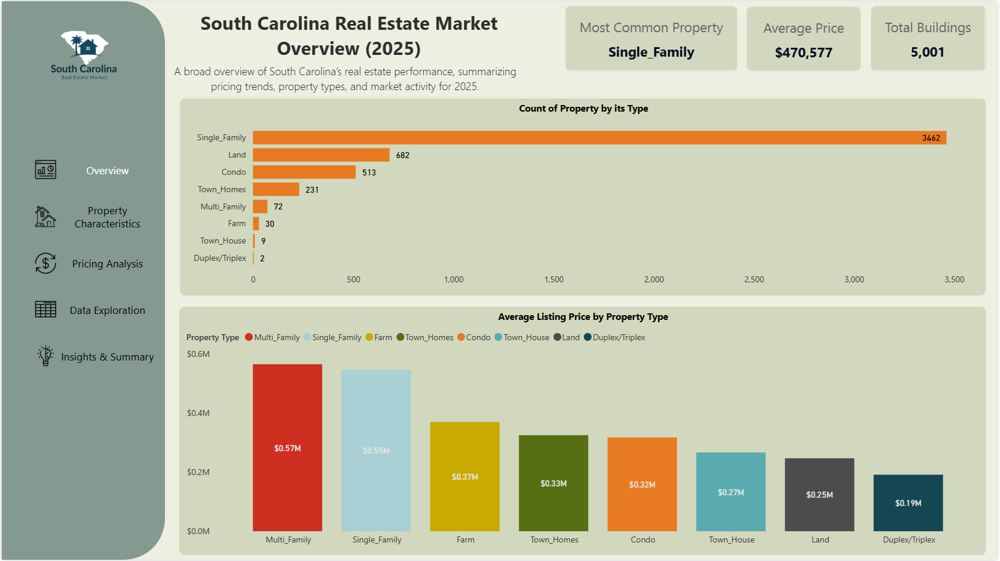

South Carolina Real Estate Market Dashboard (2025)
This repository contains a full Power BI analysis of the South Carolina real estate market for the year 2025.
The dashboard explores pricing trends, property characteristics, market composition, and key insights derived from 5,001 property listings.

📊 Dashboard Pages
1. Overview
- Most common property type
- Average listing price
- Total listings
- Count of properties by type
- Average price by property type
2. Property Characteristics
- Square footage distribution
- Bedrooms & bathrooms distribution
- Average SqFt by property type
- Price vs SqFt scatter
3. Pricing Analysis
- Price distribution
- Average price per SqFt
- Median listing price
- Price vs SqFt relationship
- Price bins
4. Data Exploration
- Fully filterable table
- Listing price, SqFt, PPSF, age
- Slicers for property type, bedrooms, bathrooms, stories, price bins, SqFt bins
5. Insights & Summary
- Market composition
- Pricing range
- Property type price differences
- Price per SqFt variation
- Home size & features
- Price distribution
- Final market takeaway

📁 Files Included
- South_Carolina_Real_Estate_2025.pbix — Full Power BI dashboard
- realestate_data_southcarolina_2025.csv — Dataset used for analysis
- /images — Dashboard screenshots

📝 Key Insights (2025)
- Single Family homes dominate the market with over 3,400 listings
- Prices range from under $200K to over $10M
- Multi Family and Single Family homes have the highest average prices
- Price per SqFt varies from low hundreds to over $3,700
- Average home size is ~1,960 SqFt with 3 bedrooms and 2 bathrooms
- Most listings fall between $200K–$400K

📌 How to Use
- Download the .pbix file
- Open in Power BI Desktop
- Explore the dashboard using slicers and filters

📜 License
MIT License (optional)

## 📸 Dashboard Preview

### **Overview Page**

### **Property Characteristics**

### **Pricing Analysis**

### **Data Exploration**

### **Insights & Summary**

